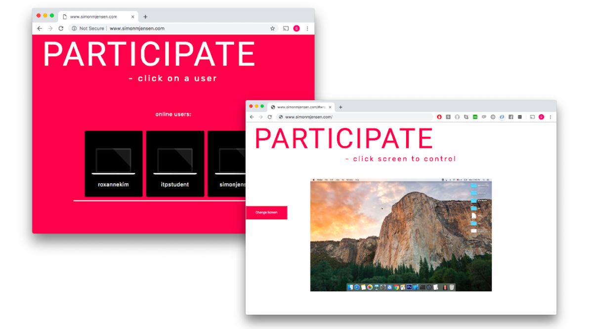

<h1> Participate </h1>

<h2> Participate is a custom built application allowing users visiting a webpage
  to take control of another persons screen, keyboard and mouse in real-time. </h2>



<p> The application is built using peer.js, electron.js and Robot.js. The project
consists of two pieces: A Desktop application and a webpage. The webpage is the central
command from which you can take control of other computers (In this case www.simonmjensen.com). The computers
you want to remote control must have the application installed. The source code for both parts is available on this page. </p>


<h3> Before testing: Be aware </h3>   
The application is part of an exploration, investigating the question: "Would
more creative applications in software be unleashed if we didn't start by
saddling designers and developers with privacy and security concerns?".
I wanted to see what we could do with software if we didn't care about safety. This application is intended
to let other users control your computer. Running the app may put your computer at risk - and you should only
use this application around people you trust/modify it to your own needs.

<h3> To test </h3>
<p> Download the repository </p>
<p> Change directory into the app folder </p>

```
[app]$ npm run client
```   

go to simonmjensen.com
